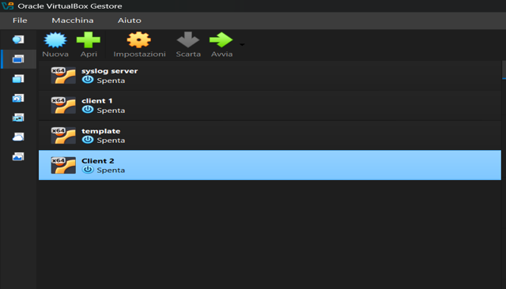
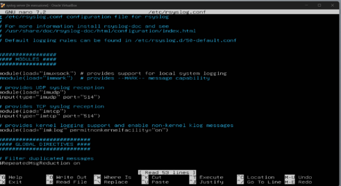

# IMPLEMENTAZIONE DI UN SYSLOG SERVER

## OBIETTIVI DEL PROGETTO

• Obiettivo:sviluppare un Syslog Server per raccogliere tutti i log dei dispositivi di rete

• Infrastruttura:

1.Hypervisor: VirtualBox.

2.Sistemi Operativi: 3 Macchine Virtuali (Ubuntu / Debian).

3.Configurazione di Rete: Modalità Bridge (per farle comunicare tra loro e con il router)

# PERCHÉ CENTRALIZZARE I LOG?

• Risoluzione dei Problemi (Troubleshooting) più veloce: Non serve accedere singolarmente a ogni client per capire cosa si è rotto. Tutti gli eventi e gli errori si leggono da un unico punto.
• Maggiore Sicurezza e Integrità dei Dati: Se un client viene attaccato o subisce un guasto , i log locali potrebbero essere cancellati o inaccessibili.
Inviandoli in tempo reale al Syslog Server, si avrà sempre una copia salva.
• Visione Globale dell'Infrastruttura: Permette di monitorare tutta la rete simultaneamente

# CONFIGURAZIONE DEL SERVER

1. Aggiornamento: Esecuzione di **sudo apt update && sudo apt upgrade** per aggionare i pacchetti.
2. Verifica IP: Identificazione dell'indirizzo di rete tramite il comando **ip a**.
3. Abilitazione Protocolli: Rimozione del commento (#) nel file **/etc/rsyslog.conf** per attivare i moduli di ricezione UDPsulla porta 514. Oltre al protocollo UDP (porta 514), ho scelto di abilitare anche il protocollo TCP per garantire il supporto a dispositivi che richiedono la consegna garantita dei log.
4. Riavvio Servizio: Esecuzione di **sudo systemctl restart rsyslog** per rendere attive le modifiche.

# CONFIGURAZIONE DEI CLIENT

1. Configurazione Inoltro: Apertura del file **/etc/rsyslog.conf** e inserimento della riga **\*.\* @192.168.1.43** per l'invio in UDP.
2. Riavvio Servizio: Esecuzione di sudo systemctl
restart rsyslog per rendere attive le modifiche e avviare
la trasmissione.

